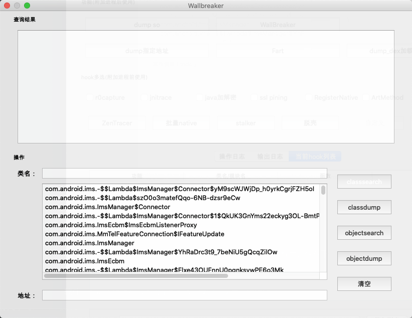
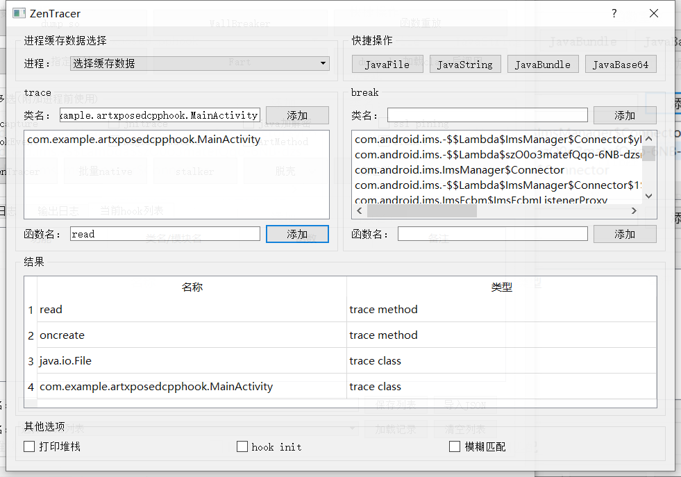
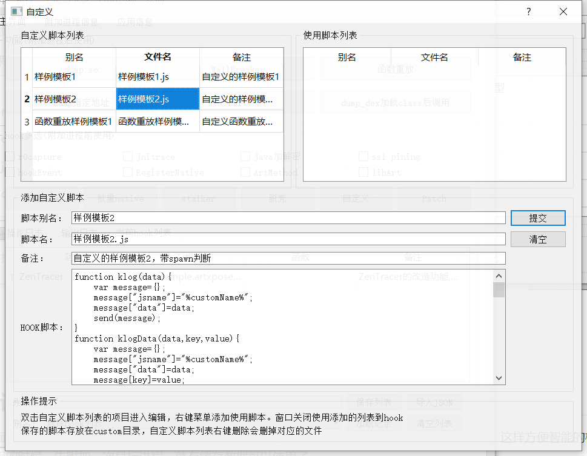

# fridaUiTools

[English](README_en.md) | **中文**

fridaUiTools是一个界面化整理脚本的工具。新人的练手作品。参考项目ZenTracer，觉得既然可以界面化，那么应该可以把功能做的更加完善一些。跨平台支持：win、mac、linux

功能缝合怪。把一些常用的frida的hook脚本简单统一输出方式后，整合进来。并且将自己觉得常用的功能做成界面调用的。还想动态获取一些信息默认的直接展示。后续会根据自己实战的经验。不断完善这个工具。

## 交流群

## 更新 2022-01-08
新增语言切换功能,支持切换English，修复fart的部分bug

## 更新 2022-12-28
新增frida16的支持，新增frida过检测

## 更新 2022-12-02
修复搜索内存功能中的一些bug，搜索到的结果新增右键查询模块信息功能。修复一些细节问题

## 更新 2022-11-25
新增功能搜索内存中的内容，附加后使用。参考来源[基于frida的android游戏内存扫描器_初稿](https://www.52pojie.cn/forum.php?mod=viewthread&tid=913009&highlight=)
新增功能内存断点trace，附加后使用。参考来源[fridaMemoryAccessTrace](https://github.com/asmjmp0/fridaMemoryAccessTrace)
fridaMemoryAccessTrace的里面有例子，使用测试可以先安装他的apk。然后module填libnative-lib.so，symbol填test_value，length填4。
实现比较简单，测试比较少。发现bug再修吧。

## 更新 2022-11-21
修复register_native_hook，修复了spawn启动会缺少一点数据的问题
优化FCAnd_jnitrace可以选择指定模块和函数

## 更新 2022-11-15
新增修改frida默认端口
新增可关闭输出日志，在文件选项中关闭（有些脚本输出数据过多，可以关掉ui上面显示的日志，直接在log目录中查看文件即可）
调整r0capture,默认将抓到的包保存在pcap目录下

## 更新 2022-11-10
参考来源[FridaContainer](https://github.com/deathmemory/FridaContainer)。
添加功能anti_debug简单的一键反调试
添加功能jnitrace，和原来版本的区别是不用指定so，不用指定函数，打印更加完整
添加内置r0gson，在自定义模块中有例子调用打印java类,需要先在上传选项中点上传gson

## 更新 2022-11-09
添加frida版本切换功能，默认使用frida15，可自行切换到14使用。没有怎么测试，发现问题可以提issue，我会解决的。

##  Hook脚本如下（附加进程前使用）

> * 整合r0capture
> * 整合jnitrace
> * java层的加解密相关自吐
> * ssl pining（整合DroidSSLUnpinning）
> * 模糊匹配函数进行批量hook（整合ZenTracer）
> * native的sub函数批量hook（参数统一方式打印。所以输出只能做参考）
> * stalker的trace（整合sktrace）
> * 整合frida_hook_libart
> * 脱壳相关（整合frida_dump、FRIDA-DEXDump、fart）
> * 自定义脚本添加
> * patch汇编代码 

## 调用功能如下（附加进程后使用）

> * fart主动调用
> * DUMPDex主动调用
> * dump打印指定地址
> * dump指定模块
> * wallBreak整合

## 应用信息

附加成功时将一些信息带出来给界面展示。目前仅将module列表和class列表展示出来。可以查询函数以及符号

### 常见问题说明

[连接常见问题](https://www.bilibili.com/video/BV16b4y1x7g5/)

[wifi连接演示](https://www.bilibili.com/video/BV1Aq4y147gu/)

## 运行

1、mac下运行需要命令进入到根目录运行

~~~
cd fridaUiTools
./kmainForm_15
~~~

2、release中打包好的应用,后缀`_14`、`_15`、`_16`分别表示打包时使用的frida不同版本

## 日志说明

### 1、操作日志

是对软件操作的所有输出日志。

### 2、输出日志

所有js返回的日志都在输出日志。并且保存在logs目录中

### 3、当前hook列表

当前勾选的hook脚本列表展示。可以保存，方便以后直接加载使用。

## 应用部分界面

## 使用说明

软件里面有很多地方用到了缓存数据。缓存数据是附加一次进程后，保存下来的module和class列表。这样方便智能的检索。所以一般第一次使用的时候，先附加一次目标进程，就有缓存数据可以使用了。

fart如果第一次使用，需要在上传与下载菜单栏中点击上传fart的so。

软件目前应该还存在很多瑕疵和bug。我会在实用中慢慢修补。

## 新增功能

> 新增切换wifi连接。如果是通过我的功能快速启动frida-server，切换连接后需要重新启动frida-server

## 简单使用例子
这个例子是用hookEvent来hook所有点击事件。要使用spawn的方式来附加。
一个新的设备初次使用需要先上传frida-server。然后选择对应的frida-server启动。然后就可以选择要hook的功能开始附加玩耍了。

## 感谢

* [jnitrace](https://github.com/chame1eon/jnitrace)
* [r0capture](https://github.com/r0ysue/r0capture)
* [ZenTracer](https://github.com/hluwa/ZenTracer)
* [DroidSSLUnpinning](https://github.com/WooyunDota/DroidSSLUnpinning)
* [frida_dump](https://github.com/lasting-yang/frida_dump)
* [FRIDA-DEXDump](https://github.com/hluwa/FRIDA-DEXDump)
* [FART](https://github.com/hanbinglengyue/FART)
* [sktrace](https://github.com/bmax121/sktrace)
* [Wallbreaker](https://github.com/hluwa/Wallbreaker)
