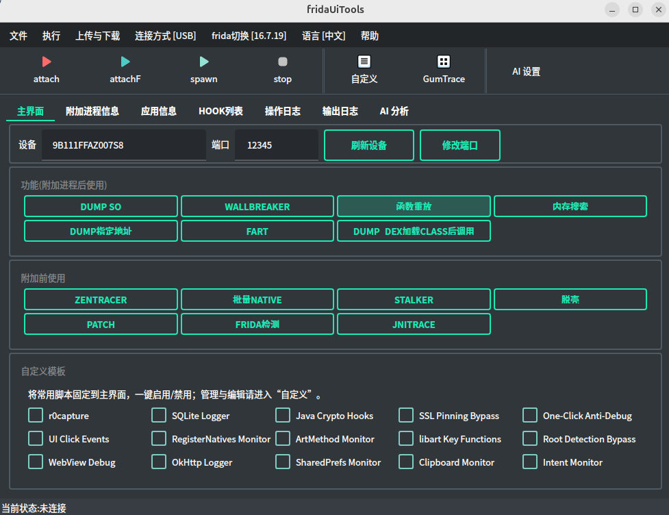

# fridaUiTools

[English](README_en.md) | **中文**

fridaUiTools 是一个基于 PyQt5 的桌面化 Frida 工作台。它把常见的连接、附加、脚本模板管理、日志查看、AI 辅助分析、GumTrace 和内存搜索整合到一个统一界面里，适合把自己常用的 Frida 脚本沉淀成一套可复用的本地仓库。



## 项目定位

- 用桌面界面降低 Frida 日常操作成本
- 将内置能力逐步收敛为“可维护的模板仓库”
- 支持把常用脚本保存为自定义模板并快速启用
- 支持接入 AI 兼容接口，用于 AI 写脚本和 AI 分析日志

## 功能概览

- 多种附加方式：附加当前前台进程、附加指定进程、spawn 附加
- 多种连接方式：USB、WiFi、自定义端口、多设备切换
- 自定义脚本管理：模板维护、快速启用、导入导出 Hook 列表
- 常用逆向能力：JNI Trace、Stalker、Dump So、Dump Dex、Patch、Wallbreaker
- AI 辅助：日志分析、脚本生成
- GumTrace 工作台：可视化生成追踪脚本、下载日志
- 内存工作台：字符串/数值搜索、断点、反汇编等实验性能力

## 运行环境

- Python 3
- ADB 可用，且设备已经开启 USB 调试
- 目标设备已具备对应架构的 `frida-server`
- Linux / macOS / Windows 均可使用

## 安装与运行

推荐使用虚拟环境：

```bash
python3 -m venv .venv
source .venv/bin/activate
pip install -r requirements.txt
python3 kmainForm.py
```

如果你已经有自己的 Python 环境，也可以直接：

```bash
pip install -r requirements.txt
python3 kmainForm.py
```

## 5 分钟快速上手

1. 连接手机，确认 `adb devices` 能看到目标设备。
2. 启动程序：`python3 kmainForm.py`。
3. 在主界面选择当前使用设备。
4. 通过菜单上传并启动对应版本的 `frida-server`。
5. 根据需要切换 USB / WiFi 连接方式和端口。
6. 选择要启用的模板或自定义脚本。
7. 使用“附加当前进程 / 附加指定进程 / spawn 附加”开始工作。
8. 在日志区查看输出。

[ai]
host = https://api.openai.com/v1
apikey = your_api_key
model = gpt-5.4
```

说明：

- 未配置 `host`、`apikey`、`model` 时，AI 写脚本和 AI 日志分析会自动禁用
- `config/ai.local.ini` 建议加入个人忽略列表，不要提交到仓库
- `host` 支持 OpenAI 兼容接口地址

## 致谢

* [jnitrace](https://github.com/chame1eon/jnitrace)
* [r0capture](https://github.com/r0ysue/r0capture)
* [ZenTracer](https://github.com/hluwa/ZenTracer)
* [DroidSSLUnpinning](https://github.com/WooyunDota/DroidSSLUnpinning)
* [frida_dump](https://github.com/lasting-yang/frida_dump)
* [FRIDA-DEXDump](https://github.com/hluwa/FRIDA-DEXDump)
* [FART](https://github.com/hanbinglengyue/FART)
* [sktrace](https://github.com/bmax121/sktrace)
* [Wallbreaker](https://github.com/hluwa/Wallbreaker)
